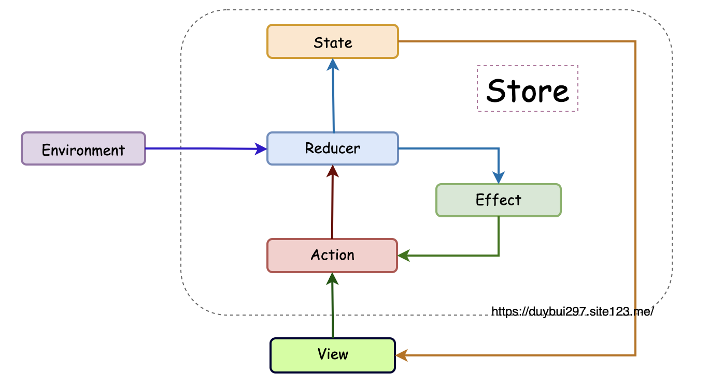

## Redux

Unidirectional Data Flow (**UDF**)

## CoreData

官方推荐在 SwiftUI 中使用 Core Data 的方式是通过的  `FetchRequest` 来进行数据查询（一个专用的 `propertyWrapper`，底层对 `NSFetchRequest` 和 `NSFetchRequestController` 进行了封装），可以自定义 `Predicate` 和 `SortDescriptor`。系统会触发 fetch 和监听 change 并进行 UI 的刷新。

### CoreData Model

Core Data 是 Obj-C 时期的产物，同时利用了一些 Obj-C 的运行时动态的特性（KVC/KVO），所以 Model 天然不支持 Immutable 类型。

但在普通的 SwiftUI 中，@Publish 修饰的属性 property 必须是 immutable 类型，否则无法知道属性发生了改变。

在 TCA 中，Immutable 非常重要。比如能够减少 View 的刷新提升性能。

### CoreData ORM

由于 Core Data 的复杂性，以及不支持 Immutable 的特性，对 SwiftUI 和 TCA 不够友好，直接将 Core Data Model 用于上层的 State 不是一个很好的选择。

一种方式是为每一个 Core Data Model 创建一个自己的 struct 类型的 Domain Model，手动的进行映射（Mapping）。但这种方式的缺点显然易见，需要写很多冗余代码，并且容易出错。

Core Data 本身就是 Obj-C 语言的 ORM，但却不是很好的 Swift ORM。[Prisma](https://github.com/prisma-ai/Sworm) 通过对 Core Data 进一步的抽象，提供一套新的 ORM 模型（主要也是利用了 Core Data 的运行时特性），Immutable, Type-safe，同时不损失大部分 Core Data 的优点。对比起手动 Mapping 也更简单。

* Attributes: 利用 Swift KeyPath 进行映射；
* Relationships: 对关系进行描述；
* Query: 对 NSFetchRequest 进一步封装，利用 KeyPath 获得类型安全。

> [SwiftData](https://developer.apple.com/documentation/swiftdata)，但依然是 class 类型，配合 Observable 使用。

## TCA

### Single Source of Truth

TCA （包括普通的 SwiftUI）强调的是单一可信数据源，所有的 State 统一管理起来，形成一棵（或多颗）状态数。而使用 `@FetchRequest` 进行访问的 Core Data 数据，没法在 TCA 中进行管理，散落在各个 View 中。

对于一个主要数据流是 CoreData 的 app 来说，使用 `@FetchRequest` 的话就没有什么必要再使用 TCA 了。（TCA 依然有很多好用的其他特性可以帮助我们更好的驾驭 SwiftUI，特别是一些独立成库的工具如 Dependence）

### Global State / Scope State

TCA 管理的这颗状态树，如果每一个 View / Feature 都能访问和修改的话，那么管理起来就会很麻烦。而且对于模块化来说会很不友好，因为会存在双向的依赖。

同样对于性能来说，如果 State 的所有变化，所有的 View 都需要重新计算刷新的话，将会对性能造成非常大的浪费和影响。

为了解决这个问题，需要一些手段来对 State 进行拆分，把它变成单向的依赖关系。在 TCA 中 Scope 的概念，加上一些 pullback （也叫 lift）的手段。同时通过引入 ViewStore 来解决 Observe Scope 切片的问题。

### Composition

TCA 中还有一个很重要的概念：**Composable**。

包括 State Composition 和 Reducer Composition。

State Composition 体现于 App State 这颗状态树的定义。而 App State 其实也影响着 Reducer 是怎么定义，因为 State, Action, Reducer 一般是成套配置的。

### Dependency

对于 Reducer 来说，同样的输入需要得到相同的输出。所以需要把不确定的东西（包括调用环境等）作为 Dependency 来管理，也就是说通过控制 Dependency 来保证 Reducer 的纯函数的要求。

假如一个 State 的值每次初始化都不是一样的，那么这个 State 就不适合作为 State 来使用，而应该作为 Dependency 来使用。

如果一个 State 需要在不同的 View / Feature 中共享，比如：不同页面都需要显示某个 State，并且部分页面可以修改这个 State，修改后所有页面都需要进行更新。对于这类的 State，更适合把它作为 Dependency 来使用。

## TCA + CoreData

TCA + Core Data 这个组合由于历史原因（所以才有了 SwiftData）没法天然的很好配合使用，比如最重要的 Data Flow 状态管理问题。还有一些问题是由于不直接使用 Core Data 而引入的新问题，有一些是 SwiftUI + Core Data 本身就有的问题或者说 Core Data 本身的问题。

新的 SwiftData 能解决很多 SwiftUI + Core Data 中的问题，但目前看到的大多数特性对于 TCA 来说并没有什么帮助，或许等 TCA 支持 Observable 后会有改变。

### Data Flow

自己实现一个类似的 FetchRequest 作为 Dependency，然后在 Reducer 中进行调用。这个 FetchRequest 对 `NSFetchRequestController` 进行封装，然后利用 `NSFetchRequestControllerDelegate` 中进行数据的监听，并且在数据发生变化时把数据更新回调到 Reducer 中。

因为 Core Data 是支持 Relationship 的，所以理想的情况 Core Data 的数据结构 Entity 也是一棵树。这样是不是能通过监听树根，来知道一整颗树的所有的变化呢？然后把 Core Data 的数据结构和 TCA 的数据结构进行对应，这样就能实现 Core Data 的数据变化，直接映射到 TCA 的 State 上了。

但理想归理想，现实情况是，首先 Core Data 并不能监听到 Relationship 对象的变化，只能监听到自己的属性的变化，所以这个方案行不通[^1]；其次，TCA 践行的是 Immutable 的 State，所有的 State 的变化，都应该是可以有迹可循的，不同 Reducer 之间的 State 的变化，是主动的通过 Action 来进行更新的，而不是通过监听的方式。举例来说就是 Child 页面是某一个时刻从 Parent 中通过 Scope 来拆分出来的，是一个 Immutable 的 State，所以 Parent 页面的 State 的变化，是不会影响到 Child 页面的 State 的，也就是在根 Reducer 监听 Core Data 树的变化，没有办法实时更新到所有的子节点的 State 上，也就没法实时刷新页面。

对于 Relationship 变化的监听，也可以通过监听 `NSManagedObjectContext.didChangeObjectsNotification` 和 `NSManagedObjectContext.didSaveObjectsNotification`，然后通过对比判断变化的对象是否属于当前 Fetched Object 的 Relationship 来进行判断[^1]。这一种方案的缺点在于没有强类型的支持[^2]，同时现实的 Relationship 可能会比较复杂，可以是 one-to-one, one-to-many, many-to-many，还可以是多层的嵌套，这样的话，对比的逻辑就会比较复杂，怎么样的颗粒度才是合适的呢？如果所有的 Object 是一颗树状，那么是否意味着每一个 Object 的变化，会导致所有父节点的 Object 都被动变化，所谓牵一发而动全身。需要监听根节点的变化，等于所有的变化，这样的话，性能就是一个问题了。并且这种方式是不是相等于直接监听通知无脑刷新页面就好了。

### KeyPath

Swift 中的 Value Type 也支持 KeyPath，但是和 Core Data 的 KeyPath 不是同一个东西，并且没有办法直接转换，因为 Swift struct 的 KeyPath 是静态的类型安全的，而 Core Data 的 KeyPath 是动态的利用了 NSObject 的运行时特性的。所以在设计接口的时候没法直接使用 KeyPath 来作为 predicate 的参数，这样会缺失很多便捷性。

### Performance

Core Data 有很多的性能优化，上述的方案会导致一部分的性能优化不起作用，比如 Fault 特性。懒加载在大量数据的时候对性能的提升还是很有帮助的。除此之外，包括使用 `fetchLimit` 来实现分页加载；通过 `predicate` 来过滤非必要的数据，不要一次把所有的对象查询出来。

## Alternative

在 [SwiftUI 与 Core Data —— 数据定义](https://www.fatbobman.com/posts/modern-Core-Data-Data-definition/) 这篇博客中的 `AnyConvertibleValueObservableObject` 和 Prisma 中的 `AnyConvertibleValue` 类似，都是对 Core Data 的 `NSManagedObject` 进行了不同形式的 Mapping 抽象。相比起来 Prisma 是一套更加成熟的方案，抽象程度更高。

而 [SwiftUI 与 Core Data —— 数据获取](https://www.fatbobman.com/posts/modern-Core-Data-fetcher/) 中的 `MockableFetchRequest`，更像是自己实现一套 `@FetchRequest` propertyWrapper，同样是直接在 View 中使用，但是可以方便进行 Mock 数据。和 `FetchRequestObserver`[^2] 相比多了方便 Mock，但是缺少了 Observer 的功能。

## Conclusion

SwiftUI + Core Data + TCA 这个组合，在目前来说还是比较不友好的，没办法既要...又要...。所以只能通过自己实现一些辅助工具来进行转换和抽象，但抽象就意味着对原有功能接口进行限制，随着功能逻辑的增加，这部分的接口就需要不断的进行扩展，这样的话，就会导致这个抽象越来越难，甚至一整套接口没法满足后来的需求而面临着重新设计重构。

同时由于没有直接使用 Core Data 的托管对象，而是转换成了一套 struct 类型的 Model，导致一些 Core Data 的性能优化没法享用。

但现在也不是没法用，可以结合实际情况来通过一些手段先解决比较重要的点。

[^1]: [NSFetchedResultsController extension to observe relationship changes](https://www.avanderlee.com/swift/nsfetchedresultscontroller-observe-relationship-changes/)
[^2][FetchRequestObserver](https://github.com/xspyhack/Alfheim/blob/master/Underworld/Sources/Persistence/FetchRequestObserver.swift)

[The Composable Architecture - Best Practices](https://www.merowing.info/the-composable-architecture-best-practices/)
[Working with a common state throughout the app](https://github.com/pointfreeco/swift-composable-architecture/discussions/1898)
[TCA - SwiftUI 的救星？\(一\)](https://onevcat.com/2021/12/tca-1/)
[聊一聊可组装框架（ TCA ）](https://www.fatbobman.com/posts/the_Composable_Architecture/)
[SwiftUI 与 Core Data —— 数据获取](https://www.fatbobman.com/posts/modern-Core-Data-fetcher/)